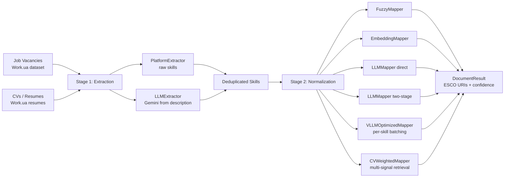
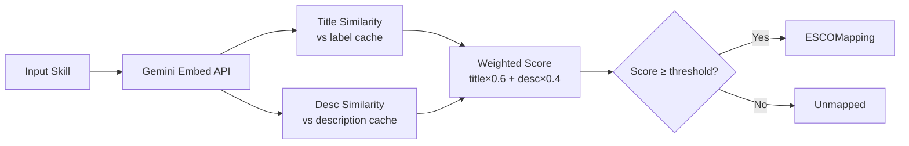
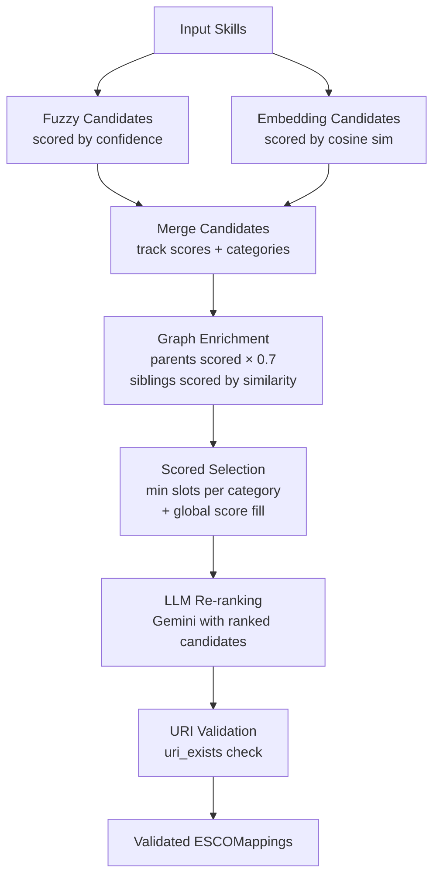

# ESCO Skill Mapping Pipeline

Extracts skills from Ukrainian job vacancies **and CVs/resumes**, then normalizes them to [ESCO taxonomy](https://esco.ec.europa.eu/) URIs.

## Overview

The pipeline operates in two stages:

1. **Extraction** — pull skills from vacancy/resume text (platform-provided raw skills or LLM-extracted from description)
2. **Normalization** — map extracted skills to ESCO using one of several strategies: fuzzy matching, semantic embeddings, LLM direct, LLM two-stage re-ranking, vLLM-optimized per-skill batching, or CV-weighted multi-signal retrieval

**Datasets:**
- Vacancies: [`KSE-RESEARCH-Group/Work_UA_vacancies`](https://huggingface.co/datasets/KSE-RESEARCH-Group/Work_UA_vacancies) (HuggingFace)
- Resumes: [`KSE-RESEARCH-Group/Work_UA_resumes`](https://huggingface.co/datasets/KSE-RESEARCH-Group/Work_UA_resumes) (HuggingFace, ~105k resumes)

**ESCO version:** v1.2.1, Ukrainian (`uk`) and English (`en`)

## Architecture

### High-level Pipeline



### Embedding Mapper



### LLM Two-Stage Mapper



## Setup

```bash
# Clone and create virtual environment
git clone <repo-url>
cd skills2
python -m venv .venv
source .venv/bin/activate
pip install -r requirements.txt

# Configure API key
cp .env.example .env
# Edit .env and set GEMINI_API_KEY
```

### ESCO Data

Download ESCO v1.2.1 Ukrainian CSV from the [ESCO portal](https://esco.ec.europa.eu/) and place it at:

```
esco/ESCO dataset - v1.2.1 - classification - uk - csv/
```

### Precompute Embeddings

Required for embedding and LLM mappers. Computes two caches:
- `esco/.embeddings_cache_uk.npz` — label embeddings
- `esco/.embeddings_cache_uk_desc.npz` — description embeddings

```bash
# First-time or regenerate both caches
rm -f esco/.embeddings_cache_uk.npz esco/.embeddings_cache_uk_desc.npz
python scripts/precompute_embeddings.py

# Verify
python scripts/verify_embeddings.py
```

The script auto-detects which caches are missing and only recomputes those.

## Usage

```bash
# Fuzzy mapper, 10 samples
python scripts/run_pipeline.py --mapper fuzzy --sample 10 --output output/results.jsonl

# Embedding mapper
python scripts/run_pipeline.py --mapper embedding --sample 10 --output output/results.jsonl

# LLM direct mapper
python scripts/run_pipeline.py --mapper llm_direct --sample 10 --output output/results.jsonl

# LLM two-stage mapper
python scripts/run_pipeline.py --mapper llm_two_stage --sample 10 --output output/results.jsonl

# vLLM optimized mapper (local model, one skill + ~10 candidates per request)
python scripts/run_pipeline.py \
  --mapper vllm_optimized \
  --provider vllm \
  --vllm-base-url http://localhost:8000/v1 \
  --vllm-model Qwen/Qwen3-30B-A3B-Instruct-2507-FP8 \
  --batch-size 64 \
  --resume \
  --output output/results.jsonl

# Take first N documents without shuffling
python scripts/run_pipeline.py --mapper fuzzy --first 100 --output output/results.jsonl

# Run all mappers
python scripts/run_pipeline.py --mapper all --sample 20 --output output/results.jsonl

# Use mock ESCO index (no API key needed)
python scripts/run_pipeline.py --mapper fuzzy --sample 5 --esco-index tests/fixtures/mock_esco.json

# --- Resume / CV pipeline ---

# Run on resumes instead of vacancies
python scripts/run_pipeline.py --source resumes --mapper fuzzy --sample 10 --output output/cv_results.jsonl

# CV-weighted mapper (multi-signal: work experience + education + platform skills)
python scripts/run_pipeline.py --source resumes --mapper cv_weighted --sample 10 --output output/cv_results.jsonl

# Evaluate against gold standard
python scripts/evaluate.py gold_standard.json output/results.jsonl
```

## Project Structure

```
skills2/
├── esco_pipeline/
│   ├── config.py              # Settings (pydantic-settings, reads .env)
│   ├── models.py              # Vacancy, Resume, ESCOMapping, DocumentResult, SkillSource
│   ├── esco_interface.py      # ESCOIndex (production) and MockESCOIndex (tests)
│   ├── llm_client.py          # Unified LLM client: Gemini or vLLM (OpenAI-compatible) backends
│   ├── loader.py              # HuggingFace dataset loader
│   ├── pipeline.py            # Deduplicates skills, runs mapper, builds results
│   ├── enrichment.py          # ESCO graph traversal (parent/sibling expansion) with scoring
│   ├── evaluation.py          # Precision / recall / F1 / unmapped / hallucination
│   ├── prompts.py             # LLM prompt templates
│   ├── utils.py               # Shared utilities
│   ├── extractors/
│   │   ├── platform_extractor.py  # Stage 1: raw skills from platform
│   │   └── llm_extractor.py      # Stage 1: Gemini-based extraction
│   └── mappers/
│       ├── fuzzy_mapper.py        # Stage 2: rapidfuzz matching
│       ├── embedding_mapper.py    # Stage 2: Gemini embeddings + cosine sim
│       ├── llm_mapper.py         # Stage 2: LLM direct & two-stage modes
│       ├── vllm_optimized_mapper.py  # Stage 2: per-skill local vLLM (max throughput)
│       └── cv_mapper.py          # Stage 2: CV multi-signal weighted mapper
├── scripts/
│   ├── run_pipeline.py            # Main CLI entry point
│   ├── precompute_embeddings.py   # One-time embedding cache builder
│   ├── verify_embeddings.py       # Embedding cache verification
│   ├── evaluate.py                # Evaluation script
│   ├── compare_mappers.py         # Cross-mapper comparison
│   └── sample_for_annotation.py   # Gold standard sampling helper
├── tests/
│   ├── fixtures/mock_esco.json    # Mock ESCO data for tests
│   ├── test_fuzzy_mapper.py
│   ├── test_embedding_mapper.py
│   ├── test_llm_mapper.py
│   ├── test_enrichment.py
│   ├── test_evaluation.py
│   ├── test_models.py
│   └── test_pipeline.py
├── esco/                          # ESCO CSV data + embedding cache (not in git)
├── output/                        # Pipeline output files
├── requirements.txt
└── .env.example
```

## Configuration

All settings are managed via environment variables (or `.env` file):

| Variable | Default | Description |
|---|---|---|
| `GEMINI_API_KEY` | *(required)* | Google Gemini API key |
| `LLM_PROVIDER` | `gemini` | LLM backend: `gemini` or `vllm` |
| `GEMINI_MODEL` | `gemini-2.5-flash` | Gemini model for LLM mappers |
| `VLLM_BASE_URL` | `http://localhost:8000/v1` | vLLM server base URL |
| `VLLM_MODEL` | `gpt-oss-120b` | Model name on the vLLM server |
| `VLLM_API_KEY` | `EMPTY` | vLLM auth key (if server requires it) |
| `ESCO_LANGUAGE` | `uk` | ESCO taxonomy language (`uk` or `en`) |
| `SAMPLE_SIZE` | `None` | Number of documents to sample (random) |
| `FUZZY_THRESHOLD` | `80.0` | Minimum fuzzy match score (0-100) |
| `EMBEDDING_THRESHOLD` | `0.72` | Minimum cosine similarity for embeddings |
| `EMBEDDING_TITLE_WEIGHT` | `0.6` | Weight for label vs description similarity |
| `EMBEDDING_SIBLING_THRESHOLD` | `0.5` | Minimum similarity for graph siblings |
| `LLM_MAX_CANDIDATES` | `100` | Max candidate URIs passed to LLM |
| `LLM_BATCH_SIZE` | `10` | Skills per LLM call |
| `LLM_MAX_CONCURRENT` | `32` | Max parallel LLM requests |
| `VLLM_CANDIDATES_PER_SKILL` | `10` | Candidates per skill for `vllm_optimized` mapper |
| `CV_EXPERIENCE_WEIGHT` | `0.8` | Weight for work experience signals (CV mapper) |
| `CV_EDUCATION_WEIGHT` | `0.5` | Weight for education signals (CV mapper) |
| `CV_OVERLAP_BOOST` | `1.3` | Boost when position + responsibilities overlap (CV mapper) |

## Testing

All tests use `MockESCOIndex` — no API key needed.

```bash
pytest tests/
```
